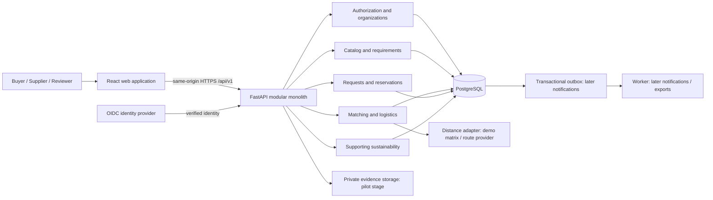
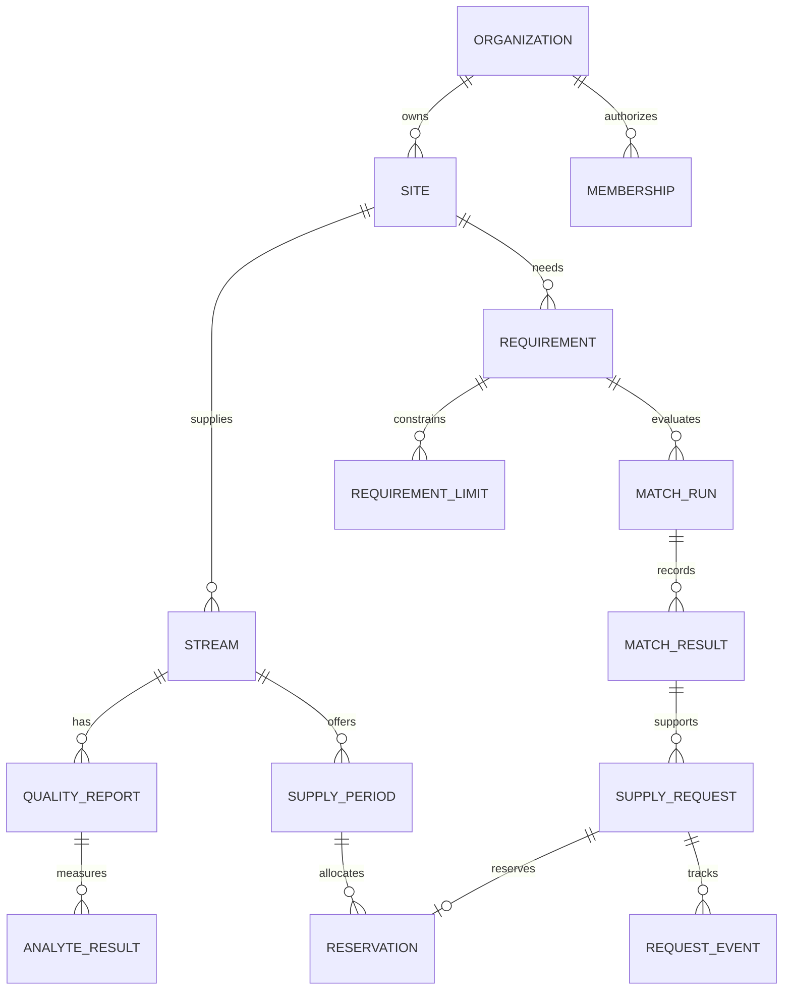
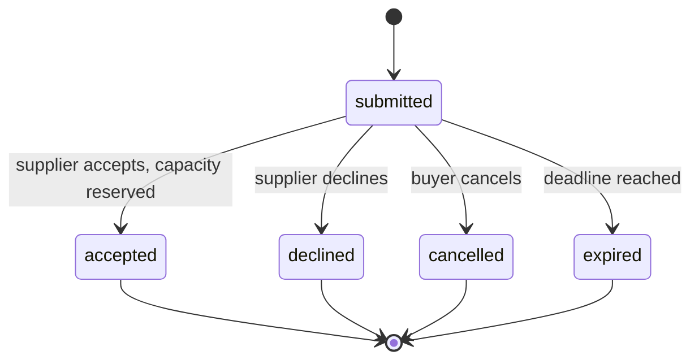

# CarbonBridge: architecture and data design

Version 1.0 | 12 September 2026 | Design proposal, not an implemented or certified system

Companion: [Three-lane implementation plan](CARBONBRIDGE_IMPLEMENTATION_PLAN.md).

## 1. Decision and source verification

Build **CarbonBridge for problem statement 8, Carbon Capture-to-Product Matchmaking Platform**. The provided 18-page HackOut'26 problem statement document places this topic on page 10. The 12-page CarbonBridge submission selects it on page 1, describes its users and nine features on pages 4-8, and proposes a software-first, 12-hour prototype on pages 9-12. Its diagram on page 3 is supplier → marketplace → matching → logistics → buyer request. This design turns that concept into explicit contracts, workflows and implementation boundaries.

The earlier banking preference concerned the final topic, the 16th statement, on page 18. The newer request supplies a selected CarbonBridge submission, so this plan proceeds with CarbonBridge rather than mixing banking into it. The original guidelines say to choose one statement; technology suggestions are advisory. These are document contents, not instructions authorizing actions on the user's computer. No downloaded document instructions have been executed. The PDFs' provenance and authenticity with the organizers have not been independently authenticated.

**Recommendation:** retain the submission's React + FastAPI direction, replace prototype SQLite with PostgreSQL from the first migration, and use a modular monolith. Build a narrow working transaction path before dashboards and supporting environmental projects. Twelve hours can produce a convincing integrated demo with production-oriented structure. It cannot establish production readiness: real product specifications, operational testing, verified data and deployment controls remain explicit release gates.

### Scope changes from the submission

| Submission concept | Architecture decision | Reason |
|---|---|---|
| Marketplace first | First vertical slice includes listing, requirement and one match | A listing board alone does not prove the value |
| SQLite prototype | PostgreSQL locally and in deployment | One set of constraints, migrations and reservation semantics |
| Weighted matching | Hard checks, separate unknown state, then deterministic ranking | Missing quality evidence must not pass |
| Monthly volume | Actual bounded supply periods | A recurring monthly label cannot prevent overselling |
| Map/distance API | Offline estimated matrix first; replaceable route adapter later | Demo reliability and explicit assumptions |
| Supply request / bid | Fixed-terms request and acceptance first | Bidding introduces negotiation/versioning beyond the first build |
| Sustainability actions | Separate P2 module with independent accounting | Keep focus and avoid misleading climate claims |
| Optional LLM | Omit from the 12-hour critical path | No training dataset is needed for transparent matching |

There is no device integration work in any lane. Input comes from validated forms and documented seed files.

## 2. Product promise and feature priorities

**Promise:** help a buyer find a technically screenable supply option, understand its commercial estimate, and initiate a traceable request. A match is a decision-support result, not a certificate of industrial suitability.

| Priority | Feature | User-visible completion condition |
|---|---|---|
| P0 | Supplier listings and search | Supplier publishes valid quality, period, quantity and price; buyer filters persisted listings |
| P0 | Buyer requirement | Buyer saves quantity, exact period, quality constraints, location and budget |
| P0 | Compatibility and explanation | Every hard rule returns pass, fail or unknown, with observed and required values |
| P0 | Delivered-cost estimate and ranking | Compatible options show reproducible cost inputs and rank reasons |
| P0 | Request, accept, decline and cancel | Authorized parties change state once; competing acceptances cannot overbook |
| P0 | Trust and demo labeling | Synthetic data, self-reported quality and estimated costs are visibly distinguished |
| P1 | Compare up to three options | Buyer sees why cheapest listed supply can cost more delivered |
| P1 | Quality gap and alternate buyer | Supplier sees failed constraints and another eligible buyer, if one exists |
| P1 | Decision receipt | User can open/export the exact saved inputs, rules and estimates behind a request |
| P1 | What-if scenario | Revised quantity/budget is evaluated without changing original requirement or request |
| P2 | Supporting environmental projects | Participation and reported impact recorded independently of marketplace volume |
| P2 | Material-flow evidence | Capture, dispatch, receipt and reuse recorded with provenance after core flow is stable |
| Later | Negotiated bids, evidence uploads, live transport quotes, assisted text | Separate releases with review gates; not fake working buttons |

The most important five differentiators, in build order, are **explainable failure**, **honest delivered economics**, **alternate-buyer discovery**, **replayable decision receipts**, and **safe what-if analysis**. These differentiate the product from a generic seller directory. Competitor choices and uniqueness have not been measured; this is a product judgment, not a claim that no one else offers these features.

## 3. User journeys and intuitive frontend

Use React + TypeScript + Vite, Tailwind, React Router, TanStack Query for server state, and a schema-backed form library. Pin tested dependency versions in lockfiles at implementation time. Domain calculations run on the backend; the browser formats values and explains results.

### Buyer journey

1. Sign in to an organization; select **Find supply**.
2. Enter need in four groups: quantity and period; quality; destination and delivery form; budget. Show units beside every field. A labeled demo action loads a fictional buyer.
3. Save the requirement and evaluate it. Results show **Compatible**, **Incompatible**, and **Needs evidence** separately.
4. Open the best result. Show the limiting quality check, available tonnes in the selected period, and listed versus delivered estimate. Expand **Why this result?** for rule rows and ranking factors.
5. Compare two or three options; review assumptions and estimate expiry.
6. Submit a request. A receipt shows the submitted terms, decision version, timestamp and next action. Supplier acceptance reserves supply; this is not payment or legal contract execution.
7. Follow the request timeline. If availability or quality changed, show a conflict and a **Refresh match** action rather than silently changing terms.

### Supplier journey

Create organization/site → draft stream → enter quality and dated supply period → review → publish → review incoming request → accept or decline. The supplier dashboard separates published supply, reserved quantity and remaining availability. For a failed match, **Find alternative buyers** evaluates published opt-in buyer requirements with the same hard rules. Do not reveal private buyer requirements.

### Supporting organization / administrator journeys

An environmental organization can draft a project and submit it for review in P2. A reviewer records what evidence was checked and approves publication; a badge must describe that scope. A company records participation, without payment processing. Admins moderate listings and review evidence through audited actions. Admin status must not silently imply universal access to all commercial records.

### Screens and states

| Route | Purpose and primary action |
|---|---|
| `/marketplace` | Search published listings; **Find supply** |
| `/requirements/new`, `/requirements/:id` | Grouped requirement form and saved summary |
| `/matches/:runId` | Ranked results, failures and missing evidence |
| `/compare?run=:id&listings=...` | Maximum three candidates, same requirement and currency |
| `/listings/:id` | Stream quality, supply periods, contextual match, **Request supply** |
| `/supplier/listings/new` | Draft → validate → publish |
| `/requests`, `/requests/:id` | Role-scoped list, terms and state timeline |
| `/dashboard` | Current organization supply/request summary |
| `/projects` | P2 projects and participation, hidden if not implemented |
| `/review` | Production/pilot moderation, not needed for the demo spine |

Layout: restrained industrial style, warm background, dark text, green primary actions, amber estimates. Put the requirement summary above results. Do not hide failures behind a score. Do not label extra purity as automatically better. Show kilograms/tonnes, percent, ppmv, INR/t and date range explicitly.

Every view has loading, empty, error and stale states. Forms retain input after errors, identify invalid fields inline, and focus an error summary. Use semantic headings, keyboard focus, labeled inputs, color-plus-text status and responsive cards at 390 px. Compare tables must remain readable at 1366×768. URL state preserves filters; refresh restores the saved requirement. API outages display retryable errors; never silently replace live responses with fixture results. A demo persona switcher exists only in an isolated demo build, never as a production authorization mechanism.

## 4. System architecture



For the demo, run web, API and PostgreSQL with one local container stack. Use polling/refetch for request updates; no WebSocket infrastructure. Matching is synchronous over a small candidate set. Do not add Kubernetes, Kafka, Redis, microservices, a vector database or blockchain without a measured need. A modular monolith preserves transaction boundaries and keeps the team focused.

For production, serve the frontend and API through one HTTPS origin, place PostgreSQL on a private network, use managed secret storage, external OIDC authentication and private object storage. Run migrations as a separate release job. An outbox and worker become necessary when notifications or long-running imports are actually shipped. FastAPI's deployment guidance explicitly separates concerns such as HTTPS, startup, restarts, replication and memory; putting an API in a container alone does not solve operations. [FastAPI deployment concepts](https://fastapi.tiangolo.com/deployment/concepts/).

### Backend structure and rules

```text
apps/api/
  app/main.py
  app/core/                 settings, identity, authorization, errors, logging
  app/db/                   session and database plumbing
  app/modules/
    organizations/
    catalog/
    requirements/
    matching/
    logistics/
    requests/
    sustainability/
  migrations/               Alembic migrations, single lane owner
  tests/                    unit and database integration tests
```

Each module has routes, input/output schemas, service logic and repository access where needed. Routes validate/authenticate and invoke services; they do not contain business calculations. Services own transaction boundaries. Repositories never commit independently. Pure matching functions receive immutable inputs and return typed decisions. Modules call public services, not another module's internal tables from a route. Shared numeric/date helpers live in one backend utility location.

Use SQLAlchemy and Alembic. Validate at the API boundary and enforce critical constraints in PostgreSQL. Separate create/update/response DTOs; never bind arbitrary client JSON directly onto a database model. Avoid generic frameworks that take longer to configure than these modules.

## 5. Identity, ownership and permissions

An organization can be both supplier and buyer. A user belongs through a membership with explicit capabilities: `org_admin`, `supplier_editor`, `buyer_editor`, `viewer`. Project reviewers use a separately granted platform capability. Tenant context is derived from an authenticated user plus verified membership; never trust a client `organization_id` on its own.

| Resource/action | Authorized parties |
|---|---|
| Published public listing summary | Authenticated marketplace members; selected non-sensitive fields only |
| Draft listing, exact facility address, evidence | Owning organization and specifically authorized reviewer |
| Requirement | Owning buyer; redacted published criteria only if buyer opts in |
| Match run / scenario | Requesting organization; selected snapshot shared with request recipient |
| Supply request | Buyer organization and relevant supplier organization |
| Submit/cancel pending request | Buyer editor in the originating organization |
| Accept/decline | Supplier editor owning that supply |
| Financial or evidence details | Explicit authorized roles, not all marketplace users |

Check permission on every list, detail, export and mutation endpoint. Guessing another UUID must not grant access. Add adversarial tenant tests before pilot use. OWASP identifies broken object-level authorization as a central API risk. [OWASP API Security Project](https://owasp.org/www-project-api-security/).

Production auth: an established OIDC provider, authorization code with PKCE, a backend-managed secure HttpOnly SameSite session, session rotation and logout invalidation. Protect cookie-authenticated writes against CSRF; restrict CORS to the real frontend origin. If identity setup exceeds the demo allocation, use server-configured seeded sessions in a local-only demo profile; prohibit this profile on public production deployment. Never store privileged credentials in browser storage or fixtures.

## 6. Relational data model

All mutable records carry UUID `id`, UTC creation/update times and integer `version`. Tenant-owned records carry `organization_id`. Use composite foreign keys or equivalent enforced service rules to prevent cross-tenant references. Prices are integer paise; measured quantities are PostgreSQL `NUMERIC`, represented as decimal strings in JSON. Soft-delete/deactivate published business records; retain immutable snapshots with a defined retention policy.

| Table | Essential fields and relationships | Invariants |
|---|---|---|
| `organizations` | name, capabilities, status, synthetic flag | No real identity implied by a fictional name |
| `users`, `memberships` | external subject, organization, role | Unique subject and unique user/org membership |
| `sites` | org, label, lat, lon, accuracy, public city | Lat [-90,90], lon [-180,180]; private precise address |
| `streams` | supplier site, source industry, CO2 origin, physical form, listing state | Quantity and purity are independent |
| `quality_reports` | stream, purity, basis, sampled_at, expires_at, evidence status | Immutable version; purity in [0,100] |
| `analyte_results` | quality report, analyte, value, unit, basis, detection limit, qualifier | Unknown is null; measurement basis explicit |
| `supply_periods` | stream, start/end, total_t, reserved_t, min_order_t, price_minor_per_t | Non-overlapping periods per stream; 0 ≤ reserved ≤ total; end > start |
| `requirements` | buyer site, period, quantity_t, minimum purity, acceptable form, max distance/budget | Positive quantity; valid bounded period; explicit draft/published state |
| `requirement_limits` | requirement, analyte, max value/unit/basis, critical flag | Unique analyte/basis requirement; no silent unit conversion |
| `rate_cards` | currency, handling_minor_per_t, rate_minor_per_t_km, validity, version, provenance | Positive effective period; immutable used version |
| `distance_estimates` | origin/destination, km, method, timestamp, validity, provenance | Never describe straight-line distance as a road route |
| `match_runs`, `match_results` | requester, immutable input snapshots, status, checks, score, engine/rate versions | Hard failure/unknown cannot be ranked compatible |
| `supply_requests` | buyer, supplier, supply period, requirement, match snapshot, quantity, status, version | No self-dealing request; parties fixed at creation |
| `reservations` | request, period, tonnes, status | One reservation per accepted request; quantity > 0 |
| `request_events`, `audit_events` | actor, object, action, old/new state, time, trace ID | Append-only to application roles; no secrets or document contents |
| `idempotency_records` | actor/route/key, body hash, response, expiry | Same key + different body rejected |
| `projects`, `participations` | organization, project category, evidence scope, participant, reported amount | P2; no automatic carbon offset credit |
| `material_flow_events`, `impact_claims` | lot, event/claim type, quantity, boundary, period, evidence, method | Later; no inferred reuse from an accepted request |
| `evidence_documents`, `outbox_events` | private storage metadata / committed notification event | Pilot/later only when needed |



Index published streams by supplier/status, supply periods by stream and dates, requests by each party/status/created time, and quality reports by stream/sample time. Start with ordinary coordinate lookup for the small dataset; add PostGIS only after real spatial query requirements justify it. Avoid indexing every field by default.

### Units and quality semantics

Tonnes mean metric tonnes of the advertised CO2 supply basis; clearly declare whether the quantity is total stream mass or contained CO2 mass. For this demo, use **contained CO2 mass** throughout. This avoids silently multiplying quoted supply by purity. Production contracts must confirm the commercial basis.

Purity is `mol_percent` on a stated `dry` or `wet` basis. Gas impurities use `ppmv` or `mol_percent` on the same stated basis. Water is reported separately with its own basis; do not add wet-basis moisture to a dry-basis composition. Conversion from mass concentration or between wet/dry bases requires supporting measurements and validated rules; otherwise return `BASIS_NOT_COMPARABLE`.

For comparable mole units, 1 mol% = 10,000 ppmv. Reject negatives and impossible same-basis composition totals; partial analyte profiles need not total 100%. A required analyte with no value is **unknown**, never zero. Below-detection results pass a maximum limit only if the documented upper detection bound is at or below that limit. An expired report yields **needs evidence**. A fresh self-reported report may support a clearly labeled demo screening result; a production buyer can require reviewed evidence.

## 7. Deterministic matching and economics

### Evaluation pipeline

Validate ownership and requirement → select active published candidates → select covering supply period and quality version → normalize comparable units → run hard checks → estimate transport → enforce hard commercial constraints → score only eligible candidates → save decision snapshot → return explanations.

The demo uses one supply period that fully covers the buyer interval. It does not prorate overlapping monthly streams or combine suppliers. A requested order reserves actual tonnes from that period, not an unbounded recurring promise. Partial sourcing and multi-period allocation are future features.

Hard checks: published/active status; period coverage; physical form; minimum purity; each required impurity limit and evidence freshness; minimum order; remaining quantity; required delivery frequency; configured maximum distance; delivered budget when specified. A known failure produces `incompatible`; otherwise a missing critical input produces `needs_evidence`; only complete passes produce `compatible`. Return all observed failures and unknowns. An unknown route or cost blocks commercial compatibility when a hard cost/distance limit depends on it. If no such limit exists, display technical screening separately and require a complete estimate before a ranked request in v1.

### Prototype transport formula

For transparent demonstration, use a linear, configurable estimate:

`logistics_paise_per_t = handling_paise_per_t + distance_km × rate_paise_per_t_km`

`delivered_paise_per_t = listed_paise_per_t + logistics_paise_per_t`

`order_total_paise = ROUND_HALF_UP(delivered_unrounded_paise_per_t × order_tonnes)`

Keep decimal precision internally; round only monetary outputs, and show that displayed unit rates may round independently. Formula version `linear-road-demo-v1`. Excludes taxes, loading equipment, conditioning, tanker availability, hazardous-material constraints, tolls and real transport scheduling. Production must use a validated quote model with physical form, vehicle capacity, trips, return legs and applicable charges. Distance alone is not transport feasibility.

Example, all illustrative: handling INR 100/t, rate INR 1/t-km. Supplier A: INR 1,900/t + 120 km = INR 2,120/t delivered. Supplier D: INR 2,100/t + 40 km = INR 2,240/t. Supplier F: INR 1,700/t + 500 km = INR 2,300/t. F wins listed price but loses delivered price. A 100 t order from A estimates INR 212,000 before excluded charges. None of these are market tariffs or actual road measurements.

### Ranking v1

Use fixed normalization constants, not candidate-set min/max, so adding an irrelevant seller does not change every score:

`score = 100 × (0.45 × cost_fit + 0.20 × distance_fit + 0.15 × quantity_headroom + 0.20 × evidence_freshness)`

- `cost_fit = clamp(1 - delivered_INR_per_t / 4000, 0, 1)`.
- `distance_fit = clamp(1 - distance_km / 600, 0, 1)`.
- `quantity_headroom = clamp((remaining_t - required_t) / required_t, 0, 1)`.
- `evidence_freshness = clamp(1 - quality_age_days / 30, 0, 1)` for fresh reports; expiry remains a hard evidence gate.

These weights, scales and 30-day window are demo policy, not standards. Equal score ties sort by delivered cost, then distance, then UUID. Purity is a hard fit criterion, not a bonus for unnecessary purity. Availability is a hard check; extra inventory is a small resilience preference, not a claim of reliability. This intentionally refines the submission's generic quality/quantity/price/distance/availability score. Save weights and normalized components with each result. Buyer-defined rank preferences are a later versioned feature.

### Gap guidance and scenarios

Return reason codes such as `PURITY_BELOW_MIN`, `QUANTITY_SHORTFALL`, `IMPURITY_ABOVE_LIMIT`, `ANALYTE_UNKNOWN`, `QUALITY_EXPIRED`, `PERIOD_NOT_COVERED`, `FORM_MISMATCH`, `BUDGET_EXCEEDED`. Explanations use deterministic templates and actual numbers. A 92% stream against 95% fails by 3 percentage points, not 3% relative. An 80 t supply against 100 t is short by 20 t.

Alternate-buyer discovery applies the same rules to opt-in published requirements. A lower purity threshold alone cannot make a match if impurities still fail. Treatment guidance names the failed property and recommends engineering review plus retesting; it does not prescribe equipment, guarantee achieved purity or estimate purification savings without data. What-if runs are new immutable scenarios referencing an original; they never overwrite live terms or lower a buyer limit automatically.

## 8. API contract and request consistency

REST prefix `/api/v1`; OpenAPI is the reviewed shared contract. JSON snake_case; UUID identifiers; UTC ISO 8601 timestamps; decimal strings for non-integer measured values; explicit currency and units. Return cursor-paginated `{items,next_cursor}` lists with bounded limits (default 20, max 100). Structured errors include `{error:{code,message,fields,trace_id}}`. Use 401 unauthenticated, 403 unauthorized action, 404 inaccessible resource, 409 stale version/capacity/idempotency conflict, and 422 validation failure.

| Endpoint | Responsibility |
|---|---|
| `GET /me` | Identity, memberships, current capabilities |
| `GET/POST /listings` | Search published summaries / create own draft |
| `GET/PATCH /listings/{id}` | Authorized read / version-checked update |
| `POST /listings/{id}/publish` | Validate quality and supply data before publication |
| `GET/POST /requirements` | Own requirements / create requirement |
| `GET/PATCH /requirements/{id}` | Versioned requirement management |
| `POST /match-runs` | Evaluate `{requirement_id, expected_version}` and persist snapshot |
| `GET /match-runs/{id}` | Results, checks, cost and rank factors |
| `POST /match-runs/{id}/scenarios` | P1 changed-input what-if, separate snapshot |
| `POST /listings/{id}/alternative-buyers` | P1 evaluate permitted published requirements |
| `GET /match-runs/{id}/receipt` | P1 authorized JSON receipt; no mutable recomputation |
| `GET/POST /requests` | Party-scoped list / create fixed-terms request |
| `GET /requests/{id}` | Parties, saved terms and timeline |
| `POST /requests/{id}/accept` | Supplier, versioned, atomic capacity reservation |
| `POST /requests/{id}/decline` | Supplier closes pending request |
| `POST /requests/{id}/cancel` | Buyer closes pending request |
| `GET /dashboard` | Authorized aggregates from actual records |
| `GET/POST /projects`, `POST /participations` | P2, feature gated |
| `GET /health/live`, `GET /health/ready` | Process alive / database and migrations ready |

Request creation body: `{match_result_id, quantity_t, expected_supply_version, note}` with `Idempotency-Key`. The server verifies that requested quantity exactly matches the evaluated quantity; a changed quantity needs a new evaluation. Record source versions, currency, formula inputs and a decision expiry (demo default 15 minutes). A request is non-binding commercial interest; acceptance allocates inventory in the app but is not a signed supply contract.



This is the complete v1 state machine. Accepted requests do not expire or cancel automatically. Pilot cancellation after acceptance needs a separate, mutually approved release workflow; fulfillment also needs a later delivery workflow. For v1, the API derives `effective_status=expired` on every read when a submitted request is past its deadline, and returns that status to the UI. Before any mutation, it locks the request, persists the expiry transition and event if applicable, and rejects acceptance. A later maintenance job persists untouched expiries; the visible state and acceptance safety do not depend on that job.

Acceptance transaction: authorize supplier → lock supply-period row and request row in a documented consistent order → check request state/version/deadline → revalidate current quality, availability and unchanged commercial terms → confirm available tonnes → insert unique reservation → increment reserved quantity → update state/version → append event/audit → commit. A stale match or changed price returns 409 and requires buyer review; never silently accept altered terms. Repeated acceptance of the same request returns its existing result without allocating again. Supply edits may not reduce total below reserved quantity.

PostgreSQL row locks can serialize conflicting updates; use real PostgreSQL for the concurrent acceptance test. [PostgreSQL explicit locking](https://www.postgresql.org/docs/current/explicit-locking.html). For defense in depth in a pilot, add row security with a non-owner application role and transaction-scoped tenant context; audit pooling and privileged bypass carefully. Row security is not a substitute for service permissions. [PostgreSQL row security](https://www.postgresql.org/docs/current/ddl-rowsecurity.html).

## 9. Limited demo data: exactly what to seed

No ML training dataset is necessary. The challenge is trustworthy semantics and demonstrable edge cases, not data volume. Use fictional organizations near Gujarat cities, locally authored commercial assumptions, and deterministic IDs. Real city labels do not imply real industrial relationships.

### File inventory and loading order

| Seed input | Rows | Purpose |
|---|---:|---|
| `organizations.json` | 8 | Four suppliers, three buyers, one supporting NGO |
| `users.json`, `memberships.json` | 5 / 5 | Two supplier personas, buyer, NGO editor, reviewer; no passwords/secrets |
| `sites.geojson` | 8 | One synthetic city-level point per organization, longitude then latitude |
| `streams.json` | 8 | One stream per deliberate success/failure case |
| `quality_reports.json` | 8 | One current or deliberately expired report per stream |
| `analyte_results.json` | 24 | Three analytes per stream; one required value null |
| `supply_periods.json` | 8 | October 2026 supply, exact period and total capacity; no reservation counters |
| `requirements.json` | 4 | Main buyer plus alternate and stricter needs |
| `requirement_limits.json` | 12 | Three explicit impurity limits per requirement |
| `rate_cards.json` | 1 | The linear demo rate above, effective-dated |
| `distance_matrix.csv` | 12 | Four supplier sites × three buyer sites; assumed distances |
| `requests.json`, `request_events.json` | 3 / 5 | Submitted, accepted and declined; valid event history |
| `reservations.json` | 1 | One 100 t accepted reservation included in period totals |
| `projects.json`, `participations.json` | 2 / 1 | P2 only, synthetic unverified participation |
| `provenance.json` | 6 | Two supplied documents, IEA rationale, commercial assumptions, quality assumptions, location assumptions |
| `expected_outcomes.json` | 8 | Expected candidate states/reason codes for the main requirement |
| `manifest.json` | 1 | Schema/fixture version, counts, seed clock, hashes, generation seed |

Do not seed computed match scores as authoritative data. Generate match runs through the actual engine and assert expected outputs. The accepted sample request references a generated immutable decision; the loader orchestrates this through domain services after raw reference data load. P2 fixtures load only when that feature is enabled. This inventory is a specification; the runnable seed files are implementation deliverables, not present merely because this document exists.

### Eight essential streams for the main buyer

Main requirement: 100 t contained CO2, 2026-10-01 through 2026-11-01 exclusive; min 95 mol% dry purity; dry O2 max 5,000 ppmv; dry CO max 10 ppmv; wet H2O max 100 ppmv; INR 2,500/t delivered ceiling; liquid form. All thresholds are fictional screening policies, not sector standards.

| Stream | Purity / capacity / price / assumed km | Expected outcome |
|---|---|---|
| S01 Ahmedabad demo cement | 96% / 500 t / INR 1,900/t / 120 km | Compatible; best score under baseline fresh reports |
| S02 high-purity demo supply | 99% / 80 t / INR 2,000/t / 200 km | Quantity shortfall, even though purity is high |
| S03 lower-purity demo stream | 92% / 300 t / INR 1,600/t / 200 km | Purity fails; alternate mineralization buyer may pass |
| S04 nearby demo stream | 98% / 140 t / INR 2,100/t / 40 km | Compatible; closest, but not cheapest delivered |
| S05 moisture-failure stream | 97% / 120 t / INR 1,900/t / 40 km | 200 ppmv wet H2O exceeds 100 limit |
| S06 distant cheap listing | 95.5% / 150 t / INR 1,700/t / 500 km | Compatible; cheapest listed, delivered INR 2,300/t |
| S07 incomplete evidence | 96% / 150 t / INR 1,900/t / 120 km | Required CO is null: needs evidence |
| S08 expired report | 96% / 150 t / INR 1,900/t / 500 km | Expired report: needs evidence |

Default passing analytes: O2 1,000 ppmv dry, CO 2 ppmv dry, H2O 50 ppmv wet. Non-expired reports share the same age so ranking comparisons isolate economics and headroom. The 100 t reservation belongs to S01, leaving 400 t; its quantity-headroom component remains capped at 1. The three seeded requests use the main 100 t requirement against S01 (accepted), S04 (submitted) and S06 (declined). This dataset intentionally holds quality profiles comparable; it does not purport to reproduce plant chemistry.

Supplier-site assignment: S01/S07 share site A (120 km from the main buyer), S02/S03 share B (200 km), S04/S05 share C (40 km), and S06/S08 share D (500 km). The four buyer requirements belong to three sites: R01 and R02 share buyer site E, R03 uses F and R04 uses G. Thus the 12-row distance matrix covers every supplier/buyer pair without conflicting distances. The NGO uses site H. All distances are authored estimates rather than derived road routes.

All four requirements use `[2026-10-01, 2026-11-01)`, monthly frequency, contained-CO2 tonnes, dry mol-percent purity and no hard distance limit. The following table specifies every commercial/quality variation and all twelve impurity-limit rows:

| Requirement | Site / quantity / purity / form | Delivered ceiling INR/t | O2 max ppmv dry | CO max ppmv dry | H2O max ppmv wet |
|---|---|---:|---:|---:|---:|
| R01 main materials buyer | E / 100 t / 95% / liquid | 2500 | 5000 | 10 | 100 |
| R02 alternate mineralization need | E / 200 t / 90% / liquid | 3000 | 5000 | 10 | 100 |
| R03 stricter fictional process | F / 60 t / 99% / liquid | 3000 | 1500 | 5 | 75 |
| R04 form-mismatch scenario | G / 120 t / 98% / gas | 3000 | 5000 | 10 | 100 |

S03 can pass all R02 checks; no stream passes R04's gas-form requirement. All streams use liquid form, monthly frequency, minimum order 25 t and the October period above. Default report sampling is `2026-09-11T06:00:00Z`, expiry `2026-10-12T06:00:00Z`; S08 instead samples on `2026-08-01T06:00:00Z` and expires on `2026-09-01T06:00:00Z`. All evidence is synthetic. For the remaining distance-matrix columns, use authored A/B/C/D distances to F of 160/80/100/300 km and to G of 200/60/140/250 km, respectively. Production requirements must come from the actual buyer's approved process specification.

### JSON shape: canonical seed stream bundle

```json
{
  "schema_version": "1.0.0",
  "id": "00000000-0000-4000-8000-000000000101",
  "fixture_key": "S01",
  "is_synthetic": true,
  "source_id": "assumption-commercial-v1",
  "supplier_site_id": "00000000-0000-4000-8000-000000000011",
  "physical_form": "liquid",
  "co2_origin": "fossil_process",
  "quality": {
    "purity": {"value": "96.0000", "unit": "mol_percent", "basis": "dry"},
    "sampled_at": "2026-09-11T06:00:00Z",
    "expires_at": "2026-10-12T06:00:00Z",
    "evidence_status": "synthetic",
    "analytes": [
      {"code": "O2", "value": "1000", "unit": "ppmv", "basis": "dry", "qualifier": "measured"},
      {"code": "CO", "value": "2", "unit": "ppmv", "basis": "dry", "qualifier": "measured"},
      {"code": "H2O", "value": "50", "unit": "ppmv", "basis": "wet", "qualifier": "measured"}
    ]
  },
  "supply_period": {
    "start": "2026-10-01", "end_exclusive": "2026-11-01",
    "total_t": "500.000", "quantity_basis": "contained_co2_mass",
    "min_order_t": "25.000", "frequency": "monthly",
    "price_minor_per_t": 190000, "currency": "INR"
  }
}
```

The bundle illustrates one record; the loader normalizes it into the separate tables/files above. `reserved_t` starts at zero on a fresh database and is derived through domain acceptance of valid requests, not arbitrary client or fixture input. `reservations.json` describes the expected allocation; validate it against the generated reservation rather than inserting it a second time. On a repeat seed, existing request IDs skip already-completed acceptance and counters are checked against reservation totals. Use GeoJSON for locations, CSV only for flat distance matrices (`origin_site_id,destination_site_id,distance_km,method,source_id`), and UTF-8 JSON for nested quality and requirements. UUIDv5 from fixture namespace + key yields stable actual seed IDs; the readable UUIDs above illustrate valid wire format.

### Provenance and safe loading

Each provenance record has `id`, `kind` (`provided_document`, `primary_reference`, `synthetic_assumption`), title, publisher/owner, URL or source filename, accessed date, applicable fields, known reuse terms and notes. Do not claim an unknown license permits redistribution. Do not upload the supplied PDFs, personal names, credentials or downloaded lab documents with the architecture commit.

Seed command contract: `seed --profile demo --seed 26 --clock 2026-09-12T06:00:00Z`. It validates JSON Schemas and references, prints planned row counts, rejects non-demo databases, upserts stable reference data transactionally, invokes domain services for sample requests, then verifies counts and invariants. A repeat does not double reservations. Reset targets only a disposable demo database with an explicit demo name/marker. Tests inject a frozen clock; real use takes server UTC. Manifest hashes detect accidental fixture drift.

## 10. Sustainability without misleading accounting

Keep captured, reserved, dispatched, received and reused mass separate. A request acceptance is not evidence of delivery or reuse. Unallocated captured inventory is not the same as residual plant emissions. If an environmental dashboard claims residual emissions, it needs a separately defined facility boundary, measured emissions inventory and reporting period.

The demo may show reserved/available quantity from core tables. Captured/reused cards appear only with corresponding synthetic material-flow events and a visible evidence label; otherwise display **Not recorded**. `avoided_emissions_tco2e` and `removed_co2_t` stay null. IEA explains that CO2 utilization's climate benefit depends on lifecycle factors including the displaced product and conversion energy; used CO2 is not automatically avoided emissions. [IEA, Putting CO2 to Use](https://www.iea.org/reports/putting-co2-to-use).

P2 projects use separate reported impacts and participation records; neither funding nor planting is subtracted from marketplace tonnes or represented as automatic compliance. A future assessed claim requires method/version, boundary, baseline, functional unit, CO2 origin, energy and transport inputs, losses, retention horizon, uncertainty, evidence and review. No universal legal emissions target is encoded. This is an accounting design boundary, not legal or engineering certification.

## 11. Reliability, security and production release gates

| Area | Demo requirement | Before a real pilot/production release |
|---|---|---|
| Authentication | Isolated seeded sessions or real OIDC; server authorization | Reviewed OIDC/session/CSRF flow; invitation and account recovery |
| Data isolation | Party/tenant checks, negative tests | Object-level access review; private evidence and tenant policy tests |
| Commercial safety | Idempotency, version checks, atomic reservation | Cancellation/fulfillment policy, real terms and quote validation |
| Quality | Unit-aware synthetic reports; unknowns visible | Buyer-approved specifications, lab provenance, expiry/review policy |
| Storage | Local PostgreSQL and versioned migration | Private managed DB, encryption, scheduled backups and restore proof |
| Operations | Health checks, sanitized logs, local restart | Alerts, ownership/on-call, incident and rollback runbooks |
| External services | Offline matrix | Timeouts, bounded retries, provenance, cache expiry, provider agreement |
| Supply chain | Lockfiles, no committed secrets | Dependency scanning, image scan, patch policy and supported versions |
| Performance | Reproducible 1,000-listing test target | Workload agreed with pilot; load test and capacity evidence |
| Privacy | Fictional entities only | Consent/contract basis, retention/deletion, access/export policy |
| Evidence upload | Deferred | Signed upload URLs, type/size limits, malware scan, no arbitrary URL fetch |

Proposed pilot service targets, to validate rather than promise: p95 ordinary API reads under 300 ms and matching under 1 second for 1,000 candidate listings on documented hardware; 99.5% monthly availability; backup recovery point ≤24 hours and recovery time ≤4 hours. Record actual measurements, not just target values. A timed restore drill must prove recovery. Begin with daily encrypted backups and add point-in-time recovery if the business needs a tighter RPO.

Structured logs carry request ID, actor/org identifiers, action and latency but exclude tokens, raw quality files and private notes. Track API errors, matching latency, failed accepts, unknown-data rate, database health and provider failures. Audit records are append-only to ordinary application roles; this is not blockchain-grade tamper proofing. Add protected external retention if the threat model requires it.

Release process: CI → migrate a staging database → build immutable artifacts → deploy staging → smoke and authorization tests → approve production release → run one migration job → deploy → verify health. Use backward-compatible expand/contract schema changes and application rollback; do not depend on destructive down-migrations. Deployment credentials are scoped to their environment.

## 12. What not to build first

Do not train an ML recommender on eight synthetic streams. Do not add a chatbot that invents purity standards. Do not build payments, carbon credits, blockchain, an auction engine, transport dispatch, automated purification design or a generic ESG suite. Do not show a green compliance badge based on a form submission. Do not weaken hard constraints to make the demo return a match. A polished, truthful exception flow is more compelling than unsupported certainty.

## 13. Decisions that remain external to implementation

The architecture is ready to guide implementation; real-world validation still needs supplier/buyer partners, approved quality specifications, transport arrangements, commercial terms, deployment region, identity-provider choice and a retention policy. Default demo choices are specified above, so these do not block a local prototype. They do block representing it as ready for real industrial transactions.

## References

- Provided `HackOut26_Problem_Statements.pdf`, 18 pages: guidelines p2, selected marketplace statement p10, banking statement p18.
- Provided `CarbonBridge_HackOut26_Ideation_Submission_Updated.pdf`, 12 pages: selection p1, workflow p3, users/features p4-8, stack/scope/plan p9-12.
- [FastAPI deployment concepts](https://fastapi.tiangolo.com/deployment/concepts/) and [container deployment](https://fastapi.tiangolo.com/deployment/docker/): operational design reference.
- [PostgreSQL explicit locking](https://www.postgresql.org/docs/current/explicit-locking.html) and [row security](https://www.postgresql.org/docs/current/ddl-rowsecurity.html): consistency and tenant-defense reference.
- [OWASP API Security Project](https://owasp.org/www-project-api-security/): authorization threat reference.
- [IEA, Putting CO2 to Use](https://www.iea.org/reports/putting-co2-to-use): climate-accounting boundary reference, not a source of fixture prices or purity limits.

External references accessed 12 September 2026. Design choices, effort estimates, rates, thresholds and fixture values are proposals by the planning team unless explicitly attributed.
